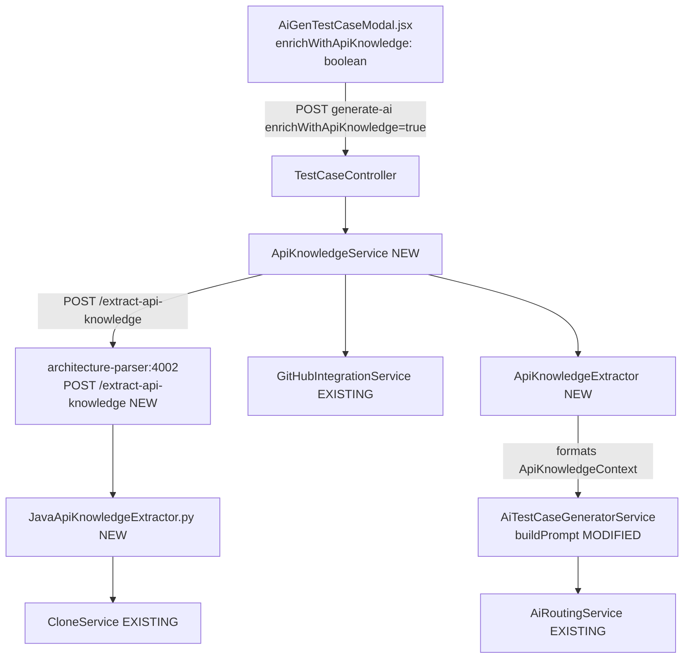
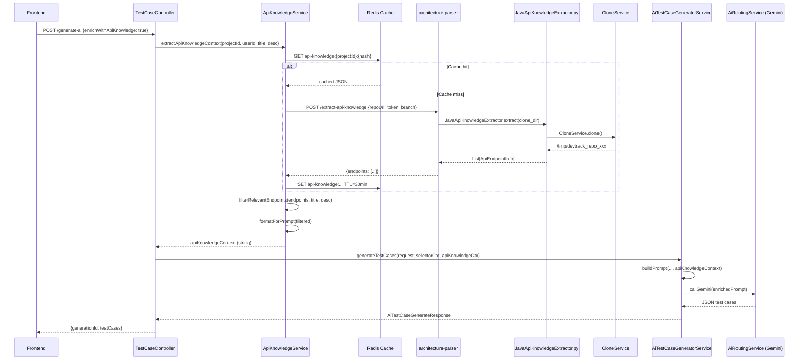
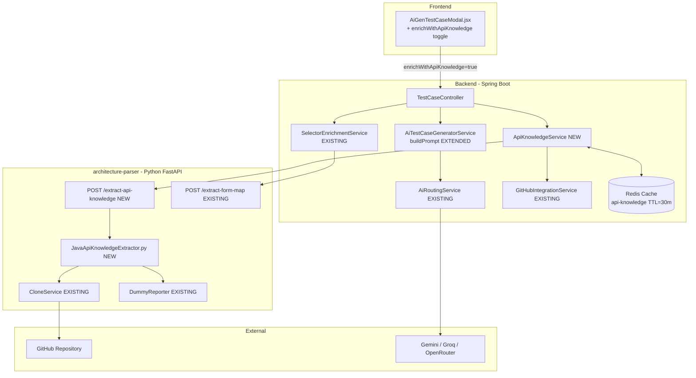
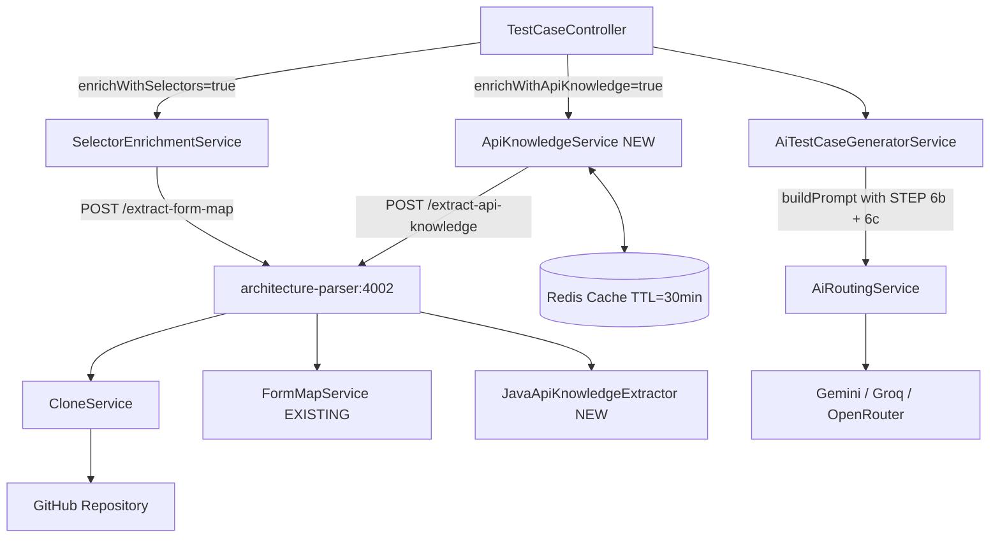

# Design Document: API Grounding — AI-Powered API Test Case Generation from Source Code

## Overview

Currently, AI-generated API test cases for DevTrackAI rely entirely on guesswork: the LLM invents endpoint paths, HTTP methods, request body field names, and expected status codes. This produces invalid test cases that fail immediately on execution.

This feature builds an **API Knowledge Extractor** — a static code analysis pipeline that parses the target project's Java Spring Boot source code directly from GitHub (no Swagger, no running server), extracts a precise API Knowledge Model, and injects it into the Gemini prompt as a grounded context section. The design mirrors the existing `SelectorEnrichmentService` + architecture-parser pattern already proven for UI test case grounding.

**Constraint**: No Swagger/OpenAPI. The target project may not have Swagger installed. Everything is derived from source code annotations only.

---

## Phase 1 — Complete AI Generation Flow Analysis

### Current AI Generation Flow (Traced End-to-End)

```
POST /api/v1/projects/{projectId}/test-cases/generate-ai
    │
    ▼
TestCaseController.generateTestCasesWithAi()
    │  resolves Principal → UserAccount
    │  calls createProcessingStaging() → AiGenerationStaging(PROCESSING)
    │  [if enrichWithSelectors] SelectorEnrichmentService.extractSelectorContext()
    │
    ▼
AiTestCaseGeneratorService.generateTestCases(request, selectorContext)
    │  loads Requirement + linked UseCases from DB
    │  builds requirementContext + useCaseContext strings
    │  calls buildPrompt(testType, smartMode, reqCtx, ucCtx, additionalCtx, selectorCtx)
    │
    ▼
AiRoutingService.generateText(prompt)
    │  routes to GeminiService (with key rotation, 503 retry, OpenRouter fallback)
    │
    ▼
parseJsonObject(rawJson) → AiTestCaseGenerateResponse { testCases: [...] }
    │
    ▼
staging.status = PENDING, staging.payload = generatedData
    │
    ▼
Response: { generationId, reasoning, coverageSummary, testCases }
```

**Where API context must be injected**: Between STEP 6 (Build Understanding) and STEP 7 (Generate Test Cases) in `buildPrompt()`. The selector context is already injected at STEP 6b — API context follows at STEP 6c.

### Existing Enrichment Architecture (Reusable Patterns)

| Component | Location | Responsibility | Reuse |
|---|---|---|---|
| `SelectorEnrichmentService` | `service/SelectorEnrichmentService.java` | Orchestrates GitHub clone → parse → format for prompt | **Mirror exactly** for API |
| `FormMapService` | `architecture-parser/services/form_map_service.py` | Parses HTML/JSX to extract form elements | Model new Java parser on this |
| `CloneService` | `architecture-parser/services/clone_service.py` | Clones GitHub repo to temp dir, cleanup | **Reuse directly** |
| `DummyReporter` | `architecture-parser/services/progress_reporter.py` | No-op reporter for non-progress endpoints | **Reuse directly** |
| `GitHubIntegrationService` | `service/github/core/GitHubIntegrationService.java` | Resolves `GitHubIntegration` entity + decrypted token | **Reuse directly** |
| `RestTemplate` (apiTest) | `config/RestTemplateConfig.java` | Named bean for API calls | **Reuse existing bean** |
| `AiRoutingService` | `service/AiRoutingService.java` | Routes prompts to Gemini/Groq/OpenRouter | **Reuse directly** |

Key lesson from `SelectorEnrichmentService`: fail-gracefully is mandatory — any exception must be caught and logged, generation must continue without enrichment context.

---

## Phase 2 — Static API Knowledge Extraction Design

### What Must Be Extracted from Java Spring Boot Source

The extractor targets these annotation patterns:

**Controller-level annotations** (define base path):
- `@RestController`, `@Controller`
- `@RequestMapping(value="/base", method=...)` on class

**Method-level annotations** (define endpoint):
- `@GetMapping`, `@PostMapping`, `@PutMapping`, `@DeleteMapping`, `@PatchMapping`
- `@RequestMapping` on method with explicit method attribute

**Parameter annotations** (define inputs):
- `@RequestBody ClassName dto` → extract DTO fields recursively
- `@PathVariable String id` / `@PathVariable("name") Long id`
- `@RequestParam String q` / `@RequestParam(value="q", required=false, defaultValue="0")`
- `@RequestHeader("Authorization") String token`

**DTO field annotations** (define constraints):
- `@NotNull`, `@NotBlank`, `@NotEmpty` → field is required
- `@Email` → must be valid email format
- `@Pattern(regexp="...")` → regex constraint
- `@Min(value)`, `@Max(value)` → numeric range
- `@Size(min, max)` → string/collection length
- `@JsonProperty("actual_name")` → overrides JSON field name

**Security annotations** (define auth requirements):
- `@PreAuthorize("hasRole('ROLE_X')")` → extract role name
- `@Secured({"ROLE_X", "ROLE_Y"})` → extract roles
- `@RolesAllowed({"ROLE_X"})` → extract roles

**Response annotations** (define expected status):
- `@ResponseStatus(HttpStatus.CREATED)` → 201
- Default: 200 OK when no annotation

### API Knowledge Model

```
ApiEndpointInfo {
  httpMethod:       String          // GET, POST, PUT, DELETE, PATCH
  path:             String          // /api/v1/projects/{projectId}/tasks
  controllerClass:  String          // TaskController
  methodName:       String          // createTask
  description:      String          // derived from method name (humanized)
  requestBody:      DtoInfo?        // null if no @RequestBody
  pathVariables:    FieldInfo[]     // @PathVariable params
  queryParams:      FieldInfo[]     // @RequestParam params
  requestHeaders:   FieldInfo[]     // @RequestHeader params
  authentication:   AuthInfo        // { required: true, roles: ["ROLE_USER"] }
  expectedStatuses: int[]           // [200], [201], [204]
  responseDto:      DtoInfo?        // return type if parseable
  sourceFile:       String          // relative path in repo
}

DtoInfo {
  className:  String
  fields:     DtoField[]
}

DtoField {
  jsonName:     String          // from @JsonProperty or camelCase field name
  javaType:     String          // String, Long, Integer, Boolean, LocalDate, ...
  required:     boolean         // @NotNull / @NotBlank / @NotEmpty
  validations:  Validation[]    // [{type: EMAIL}, {type: SIZE, min: 1, max: 255}]
}

FieldInfo {
  name:         String
  javaType:     String
  required:     boolean
  defaultValue: String?
}

AuthInfo {
  required:     boolean
  roles:        String[]        // empty = any authenticated user
  public:       boolean         // true = no auth needed
}
```

---

## Phase 3 — Architecture Design

### High-Level Component Diagram



### New Components

#### 1. `JavaApiKnowledgeExtractor.py` (architecture-parser)
**File**: `code/architecture-parser/services/java_api_knowledge_extractor.py`
**Purpose**: Static analysis of Java Spring Boot controllers and DTOs using regex + tree-sitter.
**Responsibilities**:
- Walk Java source files, identify controllers by `@RestController` / `@Controller`
- Extract base path from class-level `@RequestMapping`
- Extract endpoint info per method using Spring mapping annotations
- Resolve `@RequestBody` parameter → find DTO class → extract its fields recursively
- Extract `@PathVariable`, `@RequestParam`, `@RequestHeader` with their constraints
- Extract security annotations and map to `AuthInfo`
- Extract `@ResponseStatus` and infer default 200
- Return list of `ApiEndpointInfo` objects as JSON

**Reuses**: `CloneService` (already exists), `DummyReporter` (already exists)

#### 2. `POST /extract-api-knowledge` endpoint (architecture-parser/main.py)
**Purpose**: HTTP endpoint that accepts `{ repoUrl, token, branch }`, clones the repo, runs `JavaApiKnowledgeExtractor`, cleans up, returns JSON.
**Mirrors**: `POST /extract-form-map` exactly in structure.

#### 3. `ApiKnowledgeService.java` (backend)
**File**: `code/backend/src/main/java/org/example/backend/service/ApiKnowledgeService.java`
**Purpose**: Mirrors `SelectorEnrichmentService`. Orchestrates GitHub info resolution → architecture-parser call → filtering → formatting.
**Responsibilities**:
- `extractApiKnowledgeContext(projectId, userId, requirementTitle, requirementDesc)` — public entry point
- Resolve `GitHubIntegration` and decrypted token via `GitHubIntegrationService`
- POST to `architecture-parser:4002/extract-api-knowledge`
- Filter endpoints relevant to the requirement (keyword matching, same as `SelectorEnrichmentService.filterRelevantFiles()`)
- Format into prompt-ready string
- Truncate to `MAX_CONTEXT_CHARS = 10000`
- Fail gracefully on any exception

#### 4. Modified `AiTestCaseGenerateRequest.java`
**Change**: Add `enrichWithApiKnowledge: boolean = false` field.
**Backward compatible**: defaults to false.

#### 5. Modified `TestCaseController.generateTestCasesWithAi()`
**Change**: If `enrichWithApiKnowledge == true`, call `ApiKnowledgeService.extractApiKnowledgeContext()` after the existing selector enrichment step and pass result as `apiKnowledgeContext` to `AiTestCaseGeneratorService`.

#### 6. Modified `AiTestCaseGeneratorService.buildPrompt()`
**Change**: Add `apiKnowledgeContext` parameter. Inject STEP 6c block when non-null.

### Caching Strategy

```
Redis key:  api-knowledge:{projectId}:{sha256(repoUrl+branch)}
TTL:        30 minutes
Rationale:  Parsing a full Java repo takes 10-30s. 30min TTL avoids
            redundant clones within a work session. Cache is keyed by
            project+repo to avoid cross-project contamination.
            SelectorEnrichmentService has no cache — this is an improvement.
```

Cache logic in `ApiKnowledgeService`:
1. Compute cache key from `repoUrl + branch`
2. Check Redis — if hit, use cached JSON → parse → format
3. On miss: call architecture-parser → cache result → format
4. On any error: skip cache, fall through to null (no enrichment)

### Filtering Strategy

```
Input:  List<ApiEndpointInfo>, requirementTitle, requirementDesc
Output: Filtered subset of endpoints relevant to the requirement

Algorithm:
1. Extract keywords from requirement (words > 3 chars, minus stopwords)
2. For each endpoint:
   a. Check if path contains any keyword  → include
   b. Check if controllerClass contains any keyword → include
   c. Check if requestBody.className contains any keyword → include
3. Domain-specific expansions (same pattern as SelectorEnrichmentService):
   - "login" / "auth" → include endpoints matching /auth, /login, /token
   - "register" / "signup" → include /register, /users POST
   - "task" → include /tasks/**
   - "sprint" → include /sprints/**
4. If no results after filtering → return ALL endpoints (max 30)
5. Hard cap: max 30 endpoints in context regardless of filter result
```

### Repository Parsing Strategy

The architecture-parser already has `CloneService.clone()` for full repo cloning. The `JavaApiKnowledgeExtractor` will:
1. Walk all `.java` files
2. Skip `test/`, `*/test/*`, `*/tests/*` directories (test code)
3. Skip `entity/`, `dto/`, `repository/`, `config/` packages for the initial controller scan
4. Identify controller files: any file where class has `@RestController` or `@Controller`
5. For each controller, resolve base path then scan methods
6. For DTOs: maintain a class registry keyed by simple class name → look up when `@RequestBody` type found
7. Limit: max 200 controller methods, max 50 DTO classes scanned

---

## Phase 4 — Prompt Grounding

### New Prompt Section: STEP 6c — API Knowledge

This section is injected in `AiTestCaseGeneratorService.buildPrompt()` immediately after STEP 6b (selector context, if any) and before STEP 7 (Generate Test Cases).

```
====================================================
STEP 6c — API KNOWLEDGE
The following API information is extracted DIRECTLY from the backend source code.
No Swagger. No OpenAPI. No guessing. Pure static analysis.

Rules — VIOLATION IS A CRITICAL ERROR:
1. Use ONLY endpoints listed here. Never invent an endpoint path.
2. Never change the HTTP method (GET → POST is forbidden).
3. Never invent request body field names. Copy them CHARACTER FOR CHARACTER.
4. Respect required vs optional fields. Missing required fields MUST produce test cases for 400/422 responses.
5. Respect validation constraints (email format, min/max, pattern) when generating boundary/negative cases.
6. Use the listed authentication requirements: include Authorization header for secured endpoints.
7. Use the listed expected status codes: success cases assert 200/201/204; error cases assert 400/401/403/404.
8. If an endpoint for the tested feature is NOT in this list, write "ENDPOINT NOT FOUND" in the test case URL and mark the test as MANUAL.
====================================================

[FORMATTED API KNOWLEDGE BLOCK — see format below]
```

### API Knowledge Format (Prompt-Injected)

```
API KNOWLEDGE — extracted from source code

ENDPOINT 1: POST /api/v1/projects/{projectId}/tasks
  Controller: TaskController.createTask()
  Auth: Required — roles: [PROJECT_MEMBER]
  Path Variables:
    projectId (Long, required)
  Request Body: TaskRequest
    title (String, required, maxLength: 200)
    description (String, optional)
    priority (String, optional, values: LOW/MEDIUM/HIGH/CRITICAL)
    assigneeId (Long, optional)
    dueDate (String, optional, format: ISO date)
  Expected Status: 201 CREATED on success
  Error Status: 400 if title missing, 403 if not project member, 404 if project not found

ENDPOINT 2: GET /api/v1/projects/{projectId}/tasks
  Controller: TaskController.listTasks()
  Auth: Required — roles: [PROJECT_MEMBER]
  Path Variables:
    projectId (Long, required)
  Query Params:
    status (String, optional)
    assigneeId (Long, optional)
    page (Integer, optional, default: 0)
    size (Integer, optional, default: 20)
  Expected Status: 200 OK
  Response: Page<TaskResponse>

...
```

### Injection Point in `buildPrompt()`

```java
// After STEP 6b (selectorContext), before STEP 7:
if (apiKnowledgeContext != null && !apiKnowledgeContext.isBlank()) {
    basePrompt +=
        "====================================================\n" +
        "STEP 6c \u2014 API KNOWLEDGE (from source code)\n" +
        "====================================================\n" +
        "The following API information was extracted DIRECTLY from the backend source code.\n" +
        "No Swagger. No guessing. Static analysis only.\n\n" +
        "ABSOLUTE API RULES \u2014 VIOLATION IS A CRITICAL ERROR:\n" +
        "1. Use ONLY endpoints listed below. Never invent endpoint paths.\n" +
        "2. Never change HTTP methods. Never invent field names.\n" +
        "3. Required fields without values MUST produce 400/422 test cases.\n" +
        "4. Match validation constraints in boundary/negative test cases.\n" +
        "5. Include Authorization header for all endpoints marked Auth=Required.\n" +
        "6. Use expected status codes exactly as listed.\n" +
        "7. If the needed endpoint is NOT listed: write 'ENDPOINT NOT FOUND' and type=MANUAL.\n\n" +
        apiKnowledgeContext + "\n\n";
}
```

---

## Phase 5 — AI Test Generation Strategy

With the API Knowledge context grounded, the AI generates all 11 test case categories using only what was extracted:

| Category | How AI Uses API Knowledge |
|---|---|
| **Positive Case** | Use exact endpoint + method. Fill ALL required fields with valid values. Expect listed success status (200/201). |
| **Negative Case** | Send wrong HTTP method (PATCH instead of POST). Expect 405. Send to non-existent path variant. |
| **Boundary Case** | Use `@Min`, `@Max`, `@Size` constraints: test exactly at min, max, min-1, max+1. |
| **Security/Auth Case** | For `Auth=Required`: test without Authorization header (expect 401). With wrong token (expect 401/403). With insufficient role (expect 403). |
| **Authorization Case** | For role-restricted endpoints: test as lower-privileged role. |
| **Validation Case** | For each `@NotNull`/`@NotBlank` field: omit it → expect 400. For `@Email`: send `notanemail` → expect 400. For `@Pattern`: send non-matching string. |
| **Duplicate Case** | If DTO has unique-constraint fields (inferred from field names like `email`, `username`, `code`): send same value twice → expect 409. |
| **Missing Field Case** | Omit each required field one at a time. Expect 400 per missing field. |
| **Wrong Type Case** | Send string where Long expected (pathVariable). Send `"abc"` for numeric field in body. Expect 400. |
| **Large Payload Case** | For `@Size(max=N)` fields: send string of length N+1. For collections: send N+10 items when max is N. |
| **Invalid Enum Case** | For fields with documented enum values (OPEN/CLOSED/etc.): send `"INVALID_VALUE"`. Expect 400. |

The AI must reference field names exactly as they appear in the API Knowledge context. Any invented field name is a constraint violation.

---

## Phase 6 — Implementation Plan

### Overview Diagram



### Files to Modify

#### Backend (Java/Spring Boot)

| File | Change |
|---|---|
| `dto/testing/AiTestCaseGenerateRequest.java` | Add `private boolean enrichWithApiKnowledge = false;` |
| `service/AiTestCaseGeneratorService.java` | Add `apiKnowledgeContext` parameter to `generateTestCases()` and `buildPrompt()`. Inject STEP 6c block. |
| `controller/testing/TestCaseController.java` | Inject `ApiKnowledgeService`. Add enrichment call in `generateTestCasesWithAi()` after selector enrichment step. |

#### Backend — New Files

| File | Purpose |
|---|---|
| `service/ApiKnowledgeService.java` | Orchestrator: mirrors `SelectorEnrichmentService`. GitHub info → arch-parser call → Redis cache → filter → format. |

#### Architecture Parser (Python)

| File | Change |
|---|---|
| `main.py` | Add `POST /extract-api-knowledge` endpoint (mirrors `/extract-form-map` structure). |

#### Architecture Parser — New Files

| File | Purpose |
|---|---|
| `services/java_api_knowledge_extractor.py` | Class `JavaApiKnowledgeExtractor` with `extract(clone_dir)` method. Full Spring Boot annotation parsing. |

#### Frontend (React)

| File | Change |
|---|---|
| `features/testing/components/AiGenTestCaseModal.jsx` | Add `enrichWithApiKnowledge` state toggle in Advanced Options, pass in payload. |

---

## Low-Level Design

### `JavaApiKnowledgeExtractor.py` — Core Algorithm

```python
class JavaApiKnowledgeExtractor:
    """
    Extracts API endpoint knowledge from Java Spring Boot source code
    using regex-based annotation parsing (no execution required).
    
    Target annotations:
    - Controller: @RestController, @Controller
    - Mapping: @RequestMapping, @GetMapping, @PostMapping, @PutMapping,
               @DeleteMapping, @PatchMapping
    - Params:   @RequestBody, @PathVariable, @RequestParam, @RequestHeader
    - DTO:      @NotNull, @NotBlank, @NotEmpty, @Email, @Pattern, @Min,
                @Max, @Size, @JsonProperty
    - Security: @PreAuthorize, @Secured, @RolesAllowed
    - Response: @ResponseStatus
    """

    EXCLUDED_DIRS = {'test', 'tests', '.git', 'target', 'build'}
    MAX_CONTROLLER_METHODS = 200
    MAX_DTO_CLASSES = 50

    # Mapping annotation → HTTP method
    MAPPING_ANNOTATIONS = {
        'GetMapping':    'GET',
        'PostMapping':   'POST',
        'PutMapping':    'PUT',
        'DeleteMapping': 'DELETE',
        'PatchMapping':  'PATCH',
    }

    @classmethod
    def extract(cls, clone_dir: str) -> list:
        """
        Returns List[dict] where each dict is ApiEndpointInfo.
        """
        # Step 1: Build DTO registry {ClassName: DtoInfo}
        dto_registry = cls._build_dto_registry(clone_dir)

        # Step 2: Find and parse all controller files
        endpoints = []
        for java_file, content in cls._iter_java_files(clone_dir):
            if not cls._is_controller(content):
                continue
            base_path = cls._extract_base_path(content)
            file_endpoints = cls._parse_methods(
                content, base_path, java_file, dto_registry
            )
            endpoints.extend(file_endpoints)
            if len(endpoints) >= cls.MAX_CONTROLLER_METHODS:
                break

        return endpoints

    @classmethod
    def _build_dto_registry(cls, clone_dir: str) -> dict:
        """Scan all Java files, build {SimpleClassName: DtoInfo}."""
        registry = {}
        count = 0
        for java_file, content in cls._iter_java_files(clone_dir):
            if count >= cls.MAX_DTO_CLASSES:
                break
            # Only scan likely DTO/Request/Response classes
            filename = os.path.basename(java_file)
            if not any(kw in filename for kw in
                       ['Request', 'Response', 'Dto', 'DTO', 'Body', 'Payload']):
                continue
            dto = cls._parse_dto_class(content, filename)
            if dto:
                registry[dto['className']] = dto
                count += 1
        return registry
```

### Key Regex Patterns for Spring Boot Annotation Parsing

```python
# Controller detection
CONTROLLER_PATTERN = re.compile(
    r'@(?:Rest)?Controller\b', re.IGNORECASE)

# Class-level base path
CLASS_MAPPING_PATTERN = re.compile(
    r'@RequestMapping\s*\(\s*(?:value\s*=\s*)?["\']([^"\']+)["\']', re.IGNORECASE)

# Method mapping annotations
METHOD_MAPPING_PATTERN = re.compile(
    r'@(Get|Post|Put|Delete|Patch)Mapping\s*\('
    r'(?:[^)]*?(?:value\s*=\s*)?["\']([^"\']*)["\'])?'
    r'[^)]*\)', re.IGNORECASE | re.DOTALL)

# @RequestBody parameter
REQUEST_BODY_PATTERN = re.compile(
    r'@RequestBody\s+(?:@Valid\s+)?(\w+(?:<[^>]+>)?)\s+\w+')

# @PathVariable
PATH_VAR_PATTERN = re.compile(
    r'@PathVariable(?:\s*\(\s*(?:value\s*=\s*)?["\']([^"\']+)["\']\s*\))?\s+'
    r'(\w+)\s+(\w+)')

# @RequestParam
REQ_PARAM_PATTERN = re.compile(
    r'@RequestParam\s*\([^)]*?(?:value\s*=\s*)?["\']([^"\']+)["\']'
    r'(?:[^)]*?required\s*=\s*(true|false))?'
    r'(?:[^)]*?defaultValue\s*=\s*["\']([^"\']*)["\'])?\s*\)\s+'
    r'(\w+)\s+(\w+)')

# @ResponseStatus
RESPONSE_STATUS_PATTERN = re.compile(
    r'@ResponseStatus\s*\(\s*(?:value\s*=\s*)?HttpStatus\.(\w+)')

# @PreAuthorize
PREAUTH_PATTERN = re.compile(
    r"@PreAuthorize\s*\(\s*['\"]([^'\"]+)['\"]")

# DTO field: @JsonProperty
JSON_PROPERTY_PATTERN = re.compile(
    r'@JsonProperty\s*\(\s*["\']([^"\']+)["\']')

# DTO field: validation annotations
NOT_NULL_PATTERN = re.compile(r'@(?:NotNull|NotBlank|NotEmpty)\b')
EMAIL_PATTERN    = re.compile(r'@Email\b')
PATTERN_ANNOT    = re.compile(r'@Pattern\s*\(\s*regexp\s*=\s*["\']([^"\']+)["\']')
MIN_PATTERN      = re.compile(r'@Min\s*\(\s*(?:value\s*=\s*)?(\d+)\s*\)')
MAX_PATTERN      = re.compile(r'@Max\s*\(\s*(?:value\s*=\s*)?(\d+)\s*\)')
SIZE_PATTERN     = re.compile(
    r'@Size\s*\([^)]*?(?:min\s*=\s*(\d+))?[^)]*?(?:max\s*=\s*(\d+))?[^)]*\)')
```

### `ApiKnowledgeService.java` — Complete Interface

```java
@Service
@RequiredArgsConstructor
@Slf4j
public class ApiKnowledgeService {

    @Value("${architecture.parser.url:http://localhost:4002}")
    private String architectureParserUrl;

    private static final int MAX_CONTEXT_CHARS = 10000;
    private static final int MAX_ENDPOINTS_IN_CONTEXT = 30;
    private static final int CACHE_TTL_MINUTES = 30;

    private final GitHubIntegrationService gitHubIntegrationService;
    private final RestTemplate restTemplate;
    private final StringRedisTemplate redisTemplate;
    private final ObjectMapper objectMapper;

    /**
     * Extracts API endpoint knowledge from the project's GitHub repo backend.
     * Mirrors SelectorEnrichmentService.extractSelectorContext() exactly.
     *
     * @return formatted API knowledge string for Gemini prompt injection,
     *         or null if unavailable or any error occurs (fail-safe)
     */
    public String extractApiKnowledgeContext(Long projectId, Long userId,
                                              String requirementTitle,
                                              String requirementDesc) {
        try {
            // 1. Resolve GitHub integration
            GitHubIntegration integration = gitHubIntegrationService
                    .getIntegration(projectId, userId);
            if (integration == null) return null;

            String decryptedToken = gitHubIntegrationService
                    .getDecryptedUserToken(userId);
            if (decryptedToken == null || decryptedToken.isBlank()) return null;

            String repoUrl = String.format("https://github.com/%s/%s",
                    integration.getRepoOwner(), integration.getRepoName());

            // 2. Check Redis cache
            String cacheKey = buildCacheKey(projectId, repoUrl);
            List<Map<String, Object>> endpoints = loadFromCache(cacheKey);

            // 3. Cache miss → call architecture-parser
            if (endpoints == null) {
                endpoints = callExtractApiKnowledge(repoUrl, decryptedToken, "main");
                if (endpoints != null) {
                    saveToCache(cacheKey, endpoints);
                }
            }

            if (endpoints == null || endpoints.isEmpty()) return null;

            // 4. Filter to relevant endpoints
            List<Map<String, Object>> filtered =
                    filterRelevantEndpoints(endpoints, requirementTitle, requirementDesc);
            if (filtered.isEmpty()) filtered = endpoints;

            // 5. Cap and format
            List<Map<String, Object>> capped = filtered.stream()
                    .limit(MAX_ENDPOINTS_IN_CONTEXT)
                    .collect(java.util.stream.Collectors.toList());
            String context = formatEndpointsForPrompt(capped);

            return context.length() > MAX_CONTEXT_CHARS
                    ? context.substring(0, MAX_CONTEXT_CHARS) + "\n...(truncated)\n"
                    : context;

        } catch (Exception e) {
            log.warn("[ApiKnowledge] Failed for project {}: {}", projectId, e.getMessage());
            return null;
        }
    }

    /** Overload: no requirement context provided */
    public String extractApiKnowledgeContext(Long projectId, Long userId) {
        return extractApiKnowledgeContext(projectId, userId, "", "");
    }
}
```

### `AiTestCaseGenerateRequest.java` Changes

```java
// Add to existing class:

/**
 * If true, the backend will clone the project's GitHub repo backend source,
 * parse Spring Boot controller annotations, and inject real endpoint paths,
 * HTTP methods, request body field names, validation constraints, and expected
 * status codes into the Gemini prompt. Prevents AI from inventing API details.
 *
 * Requires GitHub integration and user token. Adds ~15-30s to generation time.
 * Defaults to false (backward compatible).
 */
private boolean enrichWithApiKnowledge = false;
```

### `AiTestCaseGeneratorService.java` — Signature Changes

```java
// Existing overloads stay, add new one:
public AiTestCaseGenerateResponse generateTestCases(
        AiTestCaseGenerateRequest request,
        String selectorContext,
        String apiKnowledgeContext) {
    // ... existing logic ...
    String prompt = buildPrompt(
            request.getTestType(), request.isSmartMode(),
            requirementContext, useCaseContext,
            request.getAdditionalContext(),
            selectorContext,
            apiKnowledgeContext);    // NEW parameter
    // ... rest unchanged ...
}

private String buildPrompt(..., String selectorContext, String apiKnowledgeContext) {
    // After STEP 6b injection block:
    if (apiKnowledgeContext != null && !apiKnowledgeContext.isBlank()) {
        basePrompt += "====================================================\n"
                + "STEP 6c \u2014 API KNOWLEDGE (from source code static analysis)\n"
                + "====================================================\n"
                + "Extracted DIRECTLY from Spring Boot controller annotations.\n"
                + "No Swagger. No guessing.\n\n"
                + "RULES \u2014 VIOLATION = CRITICAL ERROR:\n"
                + "1. Use ONLY endpoint paths listed here. Never invent paths.\n"
                + "2. Never change HTTP methods.\n"
                + "3. Copy field names CHARACTER FOR CHARACTER.\n"
                + "4. Required fields: missing = 400 test case.\n"
                + "5. Add Authorization header for Auth=Required endpoints.\n"
                + "6. Use the listed expected status codes.\n"
                + "7. Endpoint not listed: set url='ENDPOINT NOT FOUND', type=MANUAL.\n\n"
                + apiKnowledgeContext + "\n\n";
    }
}
```

### `TestCaseController.java` — generateTestCasesWithAi() Changes

```java
// Add injection:
private final ApiKnowledgeService apiKnowledgeService;

// In generateTestCasesWithAi() — after existing selector enrichment block:

// [NEW] Enrich with API Knowledge from backend source code
String apiKnowledgeContext = null;
if (request.isEnrichWithApiKnowledge()) {
    String reqTitle = "";
    String reqDesc  = "";
    if (request.getRequirementId() != null) {
        org.example.backend.entity.Requirement req =
                requirementRepository.findById(request.getRequirementId()).orElse(null);
        if (req != null) {
            reqTitle = req.getTitle() != null ? req.getTitle() : "";
            reqDesc  = req.getDescription() != null ? req.getDescription() : "";
        }
    }
    apiKnowledgeContext = apiKnowledgeService.extractApiKnowledgeContext(
            projectId, user.getId(), reqTitle, reqDesc);
}

// Pass to generator:
org.example.backend.dto.testing.AiTestCaseGenerateResponse generatedData =
        aiTestCaseGeneratorService.generateTestCases(
                request, selectorContext, apiKnowledgeContext);
```

### `main.py` — New Endpoint

```python
@app.post("/extract-api-knowledge")
async def extract_api_knowledge(request: ExtractSelectorsRequest):
    """
    Clone a GitHub repository, scan Java Spring Boot source files,
    extract controller and DTO annotation metadata, and return a
    structured API Knowledge Model as a list of endpoint definitions.

    No Swagger. No OpenAPI. No running backend required.
    Pure static annotation analysis.
    """
    clone_dir = None
    try:
        reporter = DummyReporter()
        clone_dir = CloneService.clone(
            repo_url=request.repoUrl,
            token=request.token,
            branch=request.branch,
            project_id=0,
            reporter=reporter
        )

        from services.java_api_knowledge_extractor import JavaApiKnowledgeExtractor
        endpoints = JavaApiKnowledgeExtractor.extract(clone_dir)

        return {
            "endpoints": endpoints,
            "totalEndpoints": len(endpoints),
        }

    except Exception as e:
        traceback.print_exc()
        raise HTTPException(status_code=500, detail=str(e))

    finally:
        if clone_dir:
            CloneService.cleanup(clone_dir)
```

### Frontend Toggle — `AiGenTestCaseModal.jsx`

```jsx
// New state:
const [enrichWithApiKnowledge, setEnrichWithApiKnowledge] = useState(false)

// In payload:
const payload = {
    // ...existing fields...
    enrichWithApiKnowledge,
}

// UI — in Advanced Options section, below existing selector toggle:
<div style={{ marginTop: 10 }}>
    <label style={{ display: 'flex', alignItems: 'center', gap: 8, cursor: 'pointer' }}>
        <input
            type="checkbox"
            checked={enrichWithApiKnowledge}
            onChange={(e) => setEnrichWithApiKnowledge(e.target.checked)}
        />
        <span style={{ fontSize: 13, color: C.textPri, fontWeight: 500 }}>
            Enrich with API Knowledge
        </span>
    </label>
    <p style={{ margin: '4px 0 0 22px', fontSize: 12, color: C.textSec }}>
        AI will scan your backend source code to extract real endpoints, request body
        fields, and validation constraints. Produces accurate API test cases.
        Requires GitHub integration. Adds ~15–30s.
    </p>
</div>
```

---

## Architecture Overview Diagram



---

## Data Flow Example

```
User: "Enrich with API Knowledge" checked
Requirement: "Create Task for project members"

1. Controller receives {enrichWithApiKnowledge: true, requirementId: 42}

2. ApiKnowledgeService:
   - GitHubIntegration: repoOwner="team04", repoName="swp391-backend"
   - cacheKey: "api-knowledge:7:a1b2c3..."
   - Redis: MISS
   - POST http://architecture-parser:4002/extract-api-knowledge
     → JavaApiKnowledgeExtractor scans:
       TaskController.java: @PostMapping("/api/v1/projects/{projectId}/tasks")
       TaskRequest.java: title (required @NotBlank), priority (optional enum)
     → returns [{httpMethod: "POST", path: "/api/v1/projects/{projectId}/tasks", ...}]
   - Redis SET with TTL=30min
   - Filter: "create task" keywords → matches TaskController → 3 endpoints
   - Format for prompt

3. Prompt injection (STEP 6c):
   "ENDPOINT 1: POST /api/v1/projects/{projectId}/tasks
    Auth: Required — roles: [PROJECT_MEMBER]
    Request Body: TaskRequest
      title (String, required, notBlank)
      priority (String, optional)
    Expected Status: 201 CREATED"

4. Gemini generates:
   TC-001: Create task with valid title → POST /api/v1/projects/1/tasks
           body: {title: "Fix login bug"} → expect 201 ✓
   TC-002: Create task without title → body: {} → expect 400 ✓
   TC-003: Create task without auth → no Authorization header → expect 401 ✓
   TC-004: Create task as non-member → expect 403 ✓
```

---

## Error Handling Strategy

| Scenario | Behavior |
|---|---|
| No GitHub integration for project | `enrichWithApiKnowledge` ignored, generation continues without API context |
| User has no GitHub token | Same as above |
| architecture-parser down / timeout (30s) | Fail gracefully, log warning, generation continues |
| Repo has no Java files | Empty endpoints list, no context injected |
| Zero relevant endpoints after filtering | Use all endpoints (max 30) |
| Redis unavailable | Skip cache, call architecture-parser directly each time |
| Architecture-parser returns malformed JSON | Fail gracefully, log error |
| apiKnowledgeContext exceeds 10000 chars | Truncate with "(truncated)" suffix |

**Non-blocking principle**: Any failure in the enrichment pipeline MUST NOT block test case generation. `enrichWithApiKnowledge = false` behavior is identical to current behavior.

---

## Implementation Order

1. **`services/java_api_knowledge_extractor.py`** — core extractor (testable standalone)
2. **`main.py`** — add `/extract-api-knowledge` endpoint (test with curl against real repo)
3. **`AiTestCaseGenerateRequest.java`** — add `enrichWithApiKnowledge` field
4. **`ApiKnowledgeService.java`** — orchestrator with Redis cache
5. **`AiTestCaseGeneratorService.java`** — extend `generateTestCases()` + `buildPrompt()`
6. **`TestCaseController.java`** — wire up `ApiKnowledgeService` call
7. **`AiGenTestCaseModal.jsx`** — frontend toggle
8. **Integration test** — end-to-end with a real project that has GitHub integration

---

## Testing Strategy

### Unit Tests (Backend)

- `ApiKnowledgeService`: mock architecture-parser response and Redis; verify filter logic, format output, cache hit/miss
- `AiTestCaseGeneratorService`: verify `buildPrompt()` includes STEP 6c block when `apiKnowledgeContext` is non-null; verify it is absent when null

### Unit Tests (Python)

- `JavaApiKnowledgeExtractor`: test against sample Java controller strings; verify extraction of `@PostMapping`, `@RequestBody`, `@NotBlank`, `@ResponseStatus`
- Test DTO registry: verify field extraction and `@JsonProperty` name override

### Integration Tests

- Clone a known test repo (internal fixture) → run extractor → assert expected endpoint count and field names
- Full flow: controller → ApiKnowledgeService → arch-parser (mock) → buildPrompt → verify STEP 6c present in output

### Property-Based Tests

- For any list of `ApiEndpointInfo` objects, `formatEndpointsForPrompt()` must always produce output ≤ `MAX_CONTEXT_CHARS`
- For any requirement text, `filterRelevantEndpoints()` must return a non-null list (may be empty but never null)

---

## Assumptions and Constraints

- Target project backend is Java Spring Boot (v2.x or v3.x). The extractor is Java-specific.
- The project's GitHub repo contains the backend source in a recognizable package structure (`controller/`, `service/`, `dto/`). No hardcoded package paths — directory walking only.
- `enrichWithApiKnowledge = false` by default. Existing UI test generation is 100% unaffected.
- Architecture-parser is running at `${architecture.parser.url}` (same as existing selector enrichment). No new infrastructure required.
- The `StringRedisTemplate` bean is already configured (used by `ArchitectureSyncServiceImpl`).
- Parsing adds ~15–30s per unique repo+branch combination; subsequent requests within 30 minutes use cached result and add < 1s.
- The extractor does not execute any code, connect to any database, or require the target app to be running.

---

## Architecture

The API Grounding feature extends the existing AI test case generation pipeline by adding a new enrichment branch that runs in parallel with the existing selector enrichment. The architecture follows the established pattern from `SelectorEnrichmentService`.



### Key Architectural Decisions

1. **Reuse architecture-parser microservice**: The extractor runs inside the existing Python FastAPI service at port 4002. No new microservice needed.
2. **Stateless extraction**: `JavaApiKnowledgeExtractor.extract()` takes a `clone_dir` and returns pure data. No side effects, no DB writes.
3. **Redis caching at service layer**: Cache is managed by `ApiKnowledgeService` on the Java side (same pattern as `ArchitectureSyncServiceImpl.getGraphData()`), not inside Python.
4. **Fail-safe design**: Both `SelectorEnrichmentService` and `ApiKnowledgeService` catch all exceptions and return `null`. The prompt builder handles `null` gracefully by omitting the section.
5. **Backward compatibility**: `enrichWithApiKnowledge` defaults to `false`. Existing calls to `generateTestCases(request)` and `generateTestCases(request, selectorContext)` continue to work unchanged.

---

## Components and Interfaces

### Component 1: `JavaApiKnowledgeExtractor` (Python — architecture-parser)

**Purpose**: Static analysis of Java Spring Boot controllers and DTOs. Extracts API endpoint metadata from annotation-decorated source code without executing the application.

**Interface**:
```python
class JavaApiKnowledgeExtractor:
    @classmethod
    def extract(cls, clone_dir: str) -> list[dict]:
        """
        Walks all Java files in clone_dir.
        Returns List[ApiEndpointInfo] as plain dicts.
        """

    @classmethod
    def _build_dto_registry(cls, clone_dir: str) -> dict[str, dict]:
        """
        Scans DTO/Request/Response Java files.
        Returns {ClassName: DtoInfo}.
        """

    @classmethod
    def _is_controller(cls, content: str) -> bool:
        """True if file contains @RestController or @Controller."""

    @classmethod
    def _extract_base_path(cls, content: str) -> str:
        """Extracts class-level @RequestMapping value, or empty string."""

    @classmethod
    def _parse_methods(cls, content: str, base_path: str,
                        source_file: str, dto_registry: dict) -> list[dict]:
        """Extracts one ApiEndpointInfo dict per mapping method found."""

    @classmethod
    def _parse_dto_class(cls, content: str, filename: str) -> dict | None:
        """Parses a DTO Java file into DtoInfo dict."""
```

**Responsibilities**:
- Walk Java source files, skip test directories
- Maintain DTO class registry for `@RequestBody` resolution
- Parse all Spring mapping annotations into `ApiEndpointInfo` objects
- Extract validation annotations per DTO field
- Extract security annotations and map to role lists
- Humanize method names for the `description` field

### Component 2: `POST /extract-api-knowledge` (Python — architecture-parser/main.py)

**Purpose**: HTTP endpoint that orchestrates clone → extract → cleanup → respond.

**Interface**:
```python
class ExtractSelectorsRequest(BaseModel):  # reuses existing model
    repoUrl: str
    token: Optional[str] = None
    branch: str = "main"

@app.post("/extract-api-knowledge")
async def extract_api_knowledge(request: ExtractSelectorsRequest):
    """
    Returns:
    {
        "endpoints": [ApiEndpointInfo, ...],
        "totalEndpoints": int
    }
    """
```

**Responsibilities**:
- Accept `ExtractSelectorsRequest` (reuses existing Pydantic model — no new model needed)
- Clone repo using existing `CloneService.clone()`
- Invoke `JavaApiKnowledgeExtractor.extract(clone_dir)`
- Clean up temp directory via `CloneService.cleanup()`
- Return structured JSON

### Component 3: `ApiKnowledgeService` (Java — Spring Boot)

**Purpose**: Orchestration layer between `TestCaseController` and architecture-parser. Mirrors `SelectorEnrichmentService` architecture exactly.

**Interface**:
```java
@Service
public class ApiKnowledgeService {

    public String extractApiKnowledgeContext(
            Long projectId,
            Long userId,
            String requirementTitle,
            String requirementDesc);

    public String extractApiKnowledgeContext(Long projectId, Long userId);

    // private helpers:
    private String buildCacheKey(Long projectId, String repoUrl);
    private List<Map<String, Object>> loadFromCache(String cacheKey);
    private void saveToCache(String cacheKey, List<Map<String, Object>> endpoints);
    private List<Map<String, Object>> callExtractApiKnowledge(
            String repoUrl, String token, String branch);
    private List<Map<String, Object>> filterRelevantEndpoints(
            List<Map<String, Object>> endpoints,
            String requirementTitle,
            String requirementDesc);
    private String formatEndpointsForPrompt(List<Map<String, Object>> endpoints);
}
```

**Responsibilities**:
- Resolve `GitHubIntegration` entity and decrypted token
- Check Redis cache before calling architecture-parser
- POST to `{architectureParserUrl}/extract-api-knowledge`
- Cache result with 30-minute TTL
- Filter endpoints by keyword matching against requirement
- Format list into prompt-ready string
- Catch all exceptions and return `null` (fail-safe)

**Dependencies**: `GitHubIntegrationService`, `RestTemplate`, `StringRedisTemplate`, `ObjectMapper`

### Component 4: Modified `AiTestCaseGeneratorService`

**Purpose**: Extended to accept and inject API knowledge context into the prompt.

**Interface changes**:
```java
// New overload (existing overloads unchanged):
public AiTestCaseGenerateResponse generateTestCases(
        AiTestCaseGenerateRequest request,
        String selectorContext,
        String apiKnowledgeContext);

// Extended signature:
private String buildPrompt(
        TestType testType, boolean smartMode,
        String requirementContext, String useCaseContext,
        String additionalContext,
        String selectorContext,
        String apiKnowledgeContext);  // NEW param
```

### Component 5: Modified `AiTestCaseGenerateRequest`

**Purpose**: DTO extended with new opt-in flag.

```java
private boolean enrichWithApiKnowledge = false;
```

---

## Data Models

### `ApiEndpointInfo` (Python dict / JSON schema)

```python
{
    "httpMethod":       str,          # "GET" | "POST" | "PUT" | "DELETE" | "PATCH"
    "path":             str,          # "/api/v1/projects/{projectId}/tasks"
    "controllerClass":  str,          # "TaskController"
    "methodName":       str,          # "createTask"
    "description":      str,          # "Create Task" (humanized from method name)
    "requestBody":      DtoInfo | None,
    "pathVariables":    list[FieldInfo],
    "queryParams":      list[FieldInfo],
    "requestHeaders":   list[FieldInfo],
    "authentication":   AuthInfo,
    "expectedStatuses": list[int],    # [201] or [200] or [204]
    "responseDto":      DtoInfo | None,
    "sourceFile":       str           # "src/main/.../TaskController.java"
}
```

### `DtoInfo`

```python
{
    "className": str,        # "TaskRequest"
    "fields":    list[DtoField]
}
```

### `DtoField`

```python
{
    "jsonName":    str,      # from @JsonProperty or camelCase field name
    "javaType":    str,      # "String" | "Long" | "Integer" | "Boolean" | "LocalDate"
    "required":    bool,     # true if @NotNull / @NotBlank / @NotEmpty present
    "validations": list[ValidationInfo]
}
```

### `ValidationInfo`

```python
{
    "type":    str,          # "NOT_BLANK" | "EMAIL" | "MIN" | "MAX" | "SIZE" | "PATTERN"
    "min":     int | None,   # for MIN, SIZE
    "max":     int | None,   # for MAX, SIZE
    "pattern": str | None,   # for PATTERN
}
```

### `FieldInfo`

```python
{
    "name":         str,     # parameter name
    "javaType":     str,     # "Long" | "String" | "Integer"
    "required":     bool,    # false if @RequestParam(required=false)
    "defaultValue": str | None
}
```

### `AuthInfo`

```python
{
    "required": bool,        # true = needs authentication
    "public":   bool,        # true = explicitly public
    "roles":    list[str]    # ["PROJECT_MEMBER"] or [] for any authenticated
}
```

### Prompt-Formatted Output Example

The `formatEndpointsForPrompt()` method converts the above models to:

```
API KNOWLEDGE — extracted from Spring Boot source code (static analysis)

ENDPOINT 1: POST /api/v1/projects/{projectId}/tasks
  Controller: TaskController.createTask()
  Description: Create Task
  Auth: Required — roles: [PROJECT_MEMBER]
  Path Variables:
    - projectId: Long (required)
  Request Body: TaskRequest
    - title: String (required, @NotBlank)
    - description: String (optional)
    - priority: String (optional)
    - assigneeId: Long (optional)
    - dueDate: String (optional)
  Expected Status: 201 CREATED
  Error Cases: 400 (missing required field), 403 (not member), 404 (project not found)

ENDPOINT 2: GET /api/v1/projects/{projectId}/tasks
  Controller: TaskController.listTasks()
  Description: List Tasks
  Auth: Required — roles: [PROJECT_MEMBER]
  Path Variables:
    - projectId: Long (required)
  Query Params:
    - status: String (optional)
    - page: Integer (optional, default: 0)
    - size: Integer (optional, default: 20)
  Expected Status: 200 OK
```

---

## Correctness Properties

### Property 1: Completeness

For every Spring Boot controller method annotated with a mapping annotation (`@GetMapping`, `@PostMapping`, `@PutMapping`, `@DeleteMapping`, `@PatchMapping`, or `@RequestMapping` with explicit method) in the scanned Java source, `JavaApiKnowledgeExtractor.extract()` produces at least one `ApiEndpointInfo` entry with non-empty `httpMethod` and `path` fields.

### Property 2: Path Accuracy

The `path` field in every extracted `ApiEndpointInfo` exactly concatenates the class-level `@RequestMapping` value (if present) with the method-level mapping annotation value, normalized to begin with `/` and contain no double slashes.

### Property 3: Required Field Faithfulness

A `DtoField.required = true` if and only if the corresponding Java field declaration is annotated with at least one of `@NotNull`, `@NotBlank`, or `@NotEmpty`. A field with none of those annotations always has `required = false`.

### Property 4: Fail-Safe Invariant

`ApiKnowledgeService.extractApiKnowledgeContext()` never propagates an exception to the caller. For any input (including null values, invalid project IDs, unreachable services), it returns either a non-empty formatted string or `null`.

### Property 5: Backward Compatibility

When `AiTestCaseGenerateRequest.enrichWithApiKnowledge = false` (the default), the output of `buildPrompt()` is identical to the pre-feature output. The STEP 6c block is never present in the prompt string.

### Property 6: Context Size Bound

The string returned by `ApiKnowledgeService.extractApiKnowledgeContext()` always satisfies `length <= MAX_CONTEXT_CHARS` (10,000 characters). Strings exceeding this limit are truncated before being returned.

### Property 7: Cache Correctness

For the same `projectId` and repo URL, two calls to `extractApiKnowledgeContext()` within 30 minutes return the same underlying endpoint list (cache hit on the second call). After 30 minutes, a fresh extraction is performed.

### Property 8: Filter Non-Null

`filterRelevantEndpoints(endpoints, title, desc)` always returns a non-null list. When no endpoints match the requirement keywords, the full endpoint list (capped at `MAX_ENDPOINTS_IN_CONTEXT`) is returned rather than an empty list.

---

## Error Handling

### Error Scenario 1: GitHub Integration Missing

**Condition**: `GitHubIntegrationService.getIntegration()` returns `null` for the project.
**Response**: `ApiKnowledgeService` logs at INFO level: `"[ApiKnowledge] Project X has no GitHub integration — skipping"`. Returns `null`.
**Recovery**: `TestCaseController` proceeds with `apiKnowledgeContext = null`. Prompt has no STEP 6c. Generation continues normally.

### Error Scenario 2: User GitHub Token Missing

**Condition**: `GitHubIntegrationService.getDecryptedUserToken()` returns null or blank.
**Response**: Same as above. Log at INFO level. Return `null`.
**Recovery**: Same as scenario 1.

### Error Scenario 3: Architecture-Parser Unavailable / Timeout

**Condition**: `RestTemplate.postForEntity()` throws `RestClientException` or times out (30s).
**Response**: `ApiKnowledgeService` logs at WARN level: `"[ApiKnowledge] Failed for project X: <message>"`. Returns `null`.
**Recovery**: Same as scenario 1.

### Error Scenario 4: Architecture-Parser Returns Empty Endpoints

**Condition**: Repo contains no Java files or no Spring controllers found. Response `totalEndpoints = 0`.
**Response**: Return `null`.
**Recovery**: Same as scenario 1.

### Error Scenario 5: Redis Unavailable

**Condition**: `StringRedisTemplate` operations throw exception.
**Response**: `ApiKnowledgeService` catches the Redis exception in `loadFromCache()`/`saveToCache()`. Falls through to a fresh architecture-parser call every time.
**Recovery**: Slower (no cache) but functionally correct.

### Error Scenario 6: Malformed JSON from Architecture-Parser

**Condition**: Python service returns unexpected JSON structure.
**Response**: `objectMapper.readValue()` throws. Outer catch in `extractApiKnowledgeContext()` logs at WARN. Returns `null`.
**Recovery**: Same as scenario 1.

### Error Scenario 7: apiKnowledgeContext Exceeds Size Limit

**Condition**: Formatted prompt text > `MAX_CONTEXT_CHARS` (10,000 chars).
**Response**: Context is truncated at `MAX_CONTEXT_CHARS` with appended `"\n...(truncated)\n"`.
**Recovery**: Partial context still helps constrain AI. No error thrown.

### Error Scenario 8: Clone Fails (Private Repo / Bad Token)

**Condition**: `CloneService.clone()` throws exception inside architecture-parser.
**Response**: Python endpoint returns HTTP 500. Java `RestTemplate` receives error response. `ApiKnowledgeService` catches and logs at WARN. Returns `null`.
**Recovery**: Same as scenario 1. Fail-safe.
